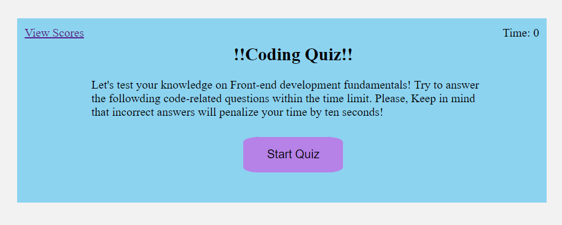
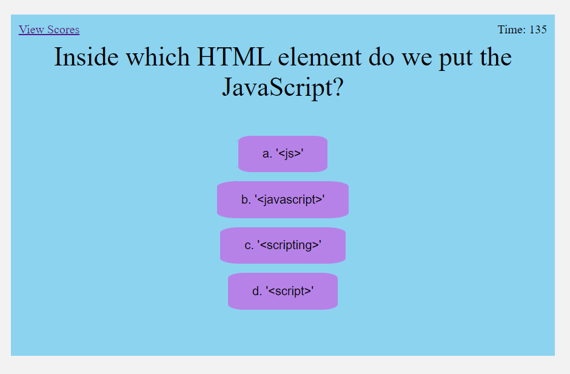

# Code-Quiz-WebDiv-IE

## Description

### User Story
AS A coding boot camp student
I WANT to take a timed quiz on JavaScript fundamentals that stores high scores
SO THAT I can gauge my progress compared to my peers

### Acceptance Criteria
GIVEN I am taking a code quiz,
WHEN I click the start button,
THEN a timer starts and I am presented with a question;
WHEN I answer a question,
THEN I am presented with another question;
WHEN I answer a question incorrectly,
THEN time is subtracted from the clock;
WHEN all questions are answered or the timer reaches 0,
THEN the game is over;
WHEN the game is over,
THEN I can save my initials and score!

<!-- Provide a short description explaining the what, why, and how of your project. Use the following questions as a guide:

- What was your motivation?
- Why did you build this project? (Note: the answer is not "Because it was a homework assignment.")
- What problem does it solve?
- What did you learn?

## Table of Contents (Optional)

If your README is long, add a table of contents to make it easy for users to find what they need.

- [Installation](#installation)
- [Usage](#usage)
- [Credits](#credits)
- [License](#license)

## Installation

What are the steps required to install your project? Provide a step-by-step description of how to get the development environment running. -->

## Usage

<!-- Provide instructions and examples for use. Include screenshots as needed.

To add a screenshot, create an `assets/images` folder in your repository and upload your screenshot to it. Then, using the relative filepath, add it to your README using the following syntax: -->

    

<!-- ## Credits

List your collaborators, if any, with links to their GitHub profiles.

If you used any third-party assets that require attribution, list the creators with links to their primary web presence in this section.

If you followed tutorials, include links to those here as well.

## License

The last section of a high-quality README file is the license. This lets other developers know what they can and cannot do with your project. If you need help choosing a license, refer to [https://choosealicense.com/](https://choosealicense.com/).

---

🏆 The previous sections are the bare minimum, and your project will ultimately determine the content of this document. You might also want to consider adding the following sections.

## Badges

Badges aren't necessary, per se, but they demonstrate street cred. Badges let other developers know that you know what you're doing. Check out the badges hosted by [shields.io](https://shields.io/). You may not understand what they all represent now, but you will in time.

## Features

If your project has a lot of features, list them here.

## How to Contribute

If you created an application or package and would like other developers to contribute it, you can include guidelines for how to do so. The [Contributor Covenant](https://www.contributor-covenant.org/) is an industry standard, but you can always write your own if you'd prefer.

## Tests

Go the extra mile and write tests for your application. Then provide examples on how to run them here. -->

<!-- ### Mock-Up
The following animation demonstrates the application functionality:

A GIF demonstrates a functioning quiz with a timer.

### Grading Requirements
NOTE
If a Challenge assignment submission is marked as “0”, it is considered incomplete and will not count towards your graduation requirements. Examples of incomplete submissions include the following:

A repository that has no code

A repository that includes a unique name but nothing else

A repository that includes only a README file but nothing else

A repository that only includes starter code

This Challenge is graded based on the following criteria:

### Technical Acceptance Criteria: 40%
Satisfies all of the above acceptance criteria.

### Deployment: 32%
Application deployed at live URL.

Application loads with no errors.

Application GitHub URL submitted.

GitHub repository that contains application code.

### Application Quality: 15%
Application user experience is intuitive and easy to navigate.

Application user interface style is clean and polished.

Application resembles the mock-up functionality provided in the Challenge instructions.

### Repository Quality: 13%
Repository has a unique name.

Repository follows best practices for file structure and naming conventions.

Repository follows best practices for class/id naming conventions, indentation, high-quality comments, etc.

Repository contains multiple descriptive commit messages.

Repository contains a high-quality README file with description, screenshot, and link to deployed application. -->